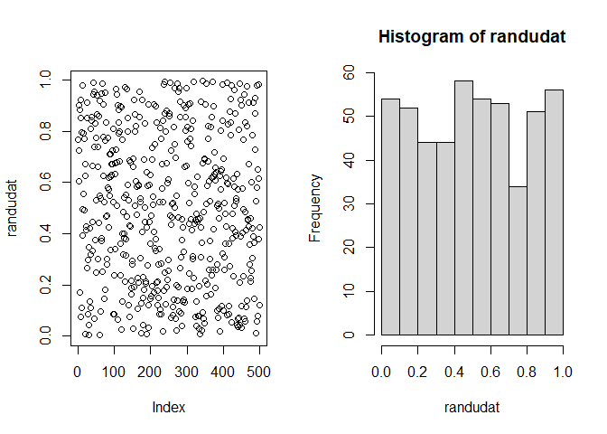

LCG
================
Xiaoni Xu
2025-01-27

``` r
lcg <- function(a, c, m, seed, nnum = 100) {
ans <- rep(0, nnum) # Initialize the array
ans[1] <- (a * seed + c) %% m
for(i in 2:nnum)
ans[i] <- (a * ans[i - 1] + c) %% m
return(ans)
}
rannums <- lcg(a = 9, c = 5, m = 16, seed = 8, nnum = 20)
rannums
```

    ##  [1] 13 10 15 12  1 14  3  0  5  2  7  4  9  6 11  8 13 10 15 12

``` r
randudat <- lcg(a = 65539, m = 2^31, c = 0, seed = 123456,
nnum = 500) / 2^31
par(mfrow=c(1,2))
plot(randudat)
hist(randudat)
```

<!-- -->

``` r
# the dots in the plot should evenly fill the space 
```
